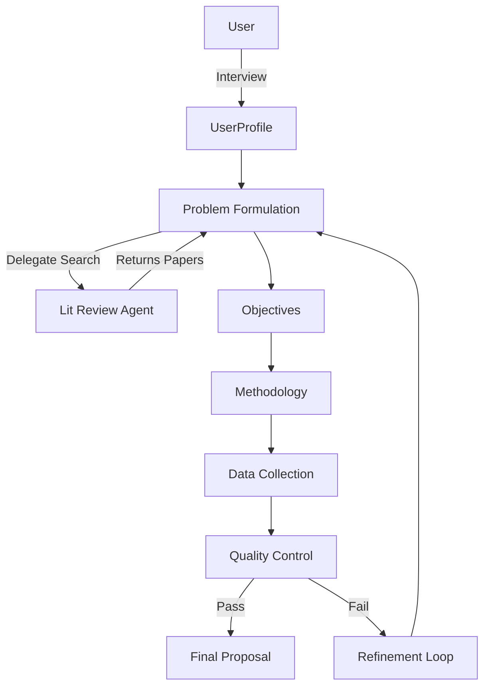

# AIDA: Academic Ideation & Drafting Assistant.

> This project was inspired by the [academic_research](https://github.com/google/adk-samples/tree/main/python/agents/academic-research) sample from the [Google ADK Samples](https://github.com/google/adk-samples) repository. Its structure served as a starting point; however, the original code was not used directly, and the scope of this project differs from the reference implementation. The sample project can be found here: [https://github.com/google/adk-samples/tree/main/python/agents/academic-research](https://github.com/google/adk-samples/tree/main/python/agents/academic-research)


## Overview

This project implements a sophisticated **multi-agent AI system** for academic research proposal generation. It leverages Google's Gemini models and the **Agent Development Kit (ADK)** to orchestrate specialized AI agents that work together to accelerate research discovery and proposal development.

The system guides researchers through a complete workflow:
1.  **Interview**: Interactive profile gathering
2.  **Problem Formulation**: AI-powered literature review and problem definition
3.  **Objectives**: SMART objective generation
4.  **Methodology**: Context-aware methodology recommendations
5.  **Data Collection**: Detailed data planning
6.  **Quality Control**: Automatic validation and refinement loops

---

## 🎯 Key Features

| Feature | Description |
|---------|-------------|
| **Multi-Agent Architecture** | 6+ specialized agents working in coordinated workflows |
| **Interactive Interfaces** | CLI Chat and Streamlit Web App options |
| **Quality Assurance** | Built-in validation and automatic refinement loops |
| **Literature Discovery** | AI-powered search via Google Search integration |
| **Cloud Deployment** | Ready for Vertex AI Agent Engine deployment |
| **Type Safety** | Pydantic data models throughout |

---

## 📋 Table of Contents

- [Quick Start](#quick-start)
- [System Architecture](#system-architecture)
- [Running the System](#running-the-system)
- [Testing & Evaluation](#testing--evaluation)
- [Project Structure](#project-structure)
- [Deployment](#deployment)

---

## Quick Start

### Prerequisites

- **Python 3.10+**
- **[uv](https://docs.astral.sh/uv/)** (recommended package manager) or `pip`
- **Google Cloud Credentials**:
    - `GOOGLE_API_KEY` (for Gemini API)
    - OR Google Cloud Project credentials (for Vertex AI)

### Installation

```bash
# Clone the repository
git clone <your-repo-url>
cd FINAL-PROJECT

# Install dependencies
uv sync
```

### Configuration

Create a `.env` file in the project root:

```bash
# Option 1: Direct API Access (Simplest)
GOOGLE_API_KEY=your_api_key_here

# Option 2: Vertex AI
GOOGLE_GENAI_USE_VERTEXAI=true
GOOGLE_CLOUD_PROJECT=your-project-id
GOOGLE_CLOUD_LOCATION=us-central1
GOOGLE_CLOUD_STORAGE_BUCKET=your-bucket-name
```

---

## Running the System

You can interact with the system in three ways:

### 1. 🖥️ Interactive CLI Demo (Recommended)
Experience the full flow in your terminal, starting with an interactive interview.

```bash
python run_interactive_demo.py
```

### 2. 🌐 Web Interface (Streamlit)
A user-friendly web application with real-time progress tracking and result downloads.

```bash
# Install Streamlit (if not already installed)
uv pip install streamlit

# Run the app
streamlit run app.py
```
*Access at `http://localhost:8501`*

### 3. ⚡ Individual Agent Demos
Test specific components in isolation.

```bash
# Problem Formulation (Real API calls)
python demos/demo_problem_formulation.py

# Full Workflow (Mocked data, fast test)
python demos/demo_orchestrator.py
```
*See [demos/README-Demos.md](demos/README-Demos.md) for details.*

---

## System Architecture


The system uses the **Orchestrator Pattern** to coordinate specialized agents.



*   **Orchestrator**: [`academic_research/orchestrator.py`](academic_research/orchestrator.py) manages state and transitions.
*   **Agents**: Located in [`academic_research/sub_agents/`](academic_research/sub_agents/).
*   **Data Models**: Defined in [`academic_research/data_models.py`](academic_research/data_models.py).

*See [docs/ARCHITECTURE.md](docs/ARCHITECTURE.md) for detailed design.*

---

## Testing & Evaluation

The project includes a comprehensive test suite and evaluation framework.

### Unit Tests
Run the full test suite using `pytest`:

```bash
uv run pytest tests/
```

### Evaluation Pipeline
Run integration scenarios to validate system performance:

```bash
# List available scenarios
uv run eval --list

# Run a specific scenario
uv run eval scenario_1_ml_research
```
*See [eval/README-Eval.md](eval/README-Eval.md) for details.*

---

## Project Structure

```
FINAL-PROJECT/
├── academic_research/                  # Core Python Package
│   ├── sub_agents/                     # Specialized Agents (The "Brains")
│   │   ├── __init__.py
│   │   ├── data_collection/
│   │   │   ├── __init__.py
│   │   │   ├── agent.py                # Logic & Factory Function
│   │   │   ├── prompt.py               # System Instructions & Templates
│   │   │   └── README.md
│   │   ├── interviewer/
│   │   │   ├── __init__.py
│   │   │   ├── agent.py                # State Machine Logic
│   │   │   ├── prompt.py
│   │   │   └── README.md
│   │   ├── literature_review/
│   │   │   ├── __init__.py
│   │   │   ├── agent.py                # Tool-Using Agent config
│   │   │   ├── prompt.py
│   │   │   └── README.md
│   │   ├── methodology/
│   │   │   ├── __init__.py
│   │   │   ├── agent.py
│   │   │   ├── prompt.py
│   │   │   └── README.md
│   │   ├── objectives/
│   │   │   ├── __init__.py
│   │   │   ├── agent.py
│   │   │   ├── prompt.py
│   │   │   └── README.md
│   │   ├── problem_formulation/
│   │   │   ├── __init__.py
│   │   │   ├── agent.py                # Agent + Sub-Agent Delegation
│   │   │   ├── prompt.py
│   │   │   └── README.md
│   │   └── quality_control/
│   │       ├── __init__.py
│   │       ├── agent.py
│   │       ├── prompt.py
│   │       └── README.md
│   │
│   ├── __init__.py
│   ├── agent_registry.py               # Discovery & Management
│   ├── communication.py                # Pub/Sub Event Bus
│   ├── config.py                       # Global Config & Retry Logic
│   ├── data_models.py                  # Pydantic Schemas (The Contracts)
│   ├── message_router.py               # Inter-agent routing & logging
│   ├── orchestrator.py                 # Main Workflow Coordinator
│   ├── proposal_builder.py             # JSON to Markdown Converter
│   ├── questionnaire.py                # Interviewer static data
│   ├── state_manager.py                # Persistence (.gemini/ folder IO)
│   └── workflow_state.py               # Finite State Machine definitions
│
├── demos/                              # Interactive Playground
│   ├── demo_data_collection.py
│   ├── demo_methodology.py
│   ├── demo_objectives.py
│   ├── demo_orchestrator.py
│   ├── demo_problem_formulation.py
│   └── demo_quality_control.py
│
├── docs/                               # Documentation
│   ├── AGENT-GUIDE.md
│   ├── ARCHITECTURE.md
│   └── DATA-FLOW.md
│
├── eval/                               # Evaluation Framework
│   ├── data/                           # Test Scenarios (JSON)
│   │   ├── scenario_1_ml_research.json
│   │   ├── scenario_2_bio_data.json
│   │   ├── scenario_3_engineering.json
│   │   └── scenario_4_tight_timeline.json
│   ├── output/                         # Artifacts (Reports/Results)
│   ├── README-eval.md
│   └── test_multi_agent_pipeline.py    # Main End-to-End Test Script
│
├── tests/                              # Unit Tests (Pytest)
│   ├── test_communication.py
│   ├── test_data_collection_agent.py
│   ├── test_interviewer_agent.py
│   ├── test_methodology_agent.py
│   ├── test_objectives_agent.py
│   ├── test_orchestrator.py
│   ├── test_problem_formulation_agent.py
│   ├── test_quality_control_agent.py
│   ├── test_state_management.py
│   └── README-tests.md
│
├── .env                                # API Credentials (GitIgnored)
├── .gitignore
├── academic-research.svg               # Architecture diagram image
├── app.py                              # Streamlit web application
├── pyproject.toml                      # Project & dependency config
├── README.md                           # Main Project documentation
├── run_interactive_demo.py             # CLI Entry point
└── uv.lock                             # Dependency lock file
```

---


## Deployment

Deploy to Vertex AI Agent Engine:

```bash
# 1. Install deployment dependencies
uv sync --group deployment

# 2. Deploy agents
uv run deployment/deploy.py --create

# 3. Test deployment
uv run deployment/test_deployment.py --resource_id=<AGENT_ENGINE_ID>
```

---

## Documentation

- **[ARCHITECTURE.md](docs/ARCHITECTURE.md)**: Deep dive into system design.
- **[DATA-FLOW.md](docs/DATA-FLOW.md)**: How data moves through the pipeline.
- **[AGENT-GUIDE.md](docs/AGENT-GUIDE.md)**: Detailed agent specifications.
