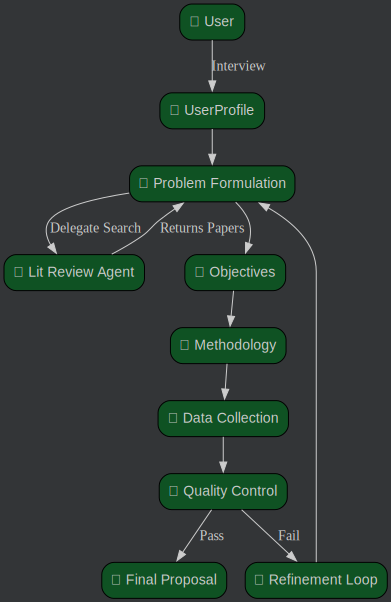

# AIDA: Academic Ideation & Drafting Assistant

> **Note:** This project was inspired by the [academic_research](https://github.com/google/adk-samples/tree/main/python/agents/academic-research) sample from the [Google ADK Samples](https://github.com/google/adk-samples) repository. While the structure served as a starting point, this implementation uses a custom Orchestrator pattern, strict Pydantic enforcement, and an enhanced PDF generation pipeline.

## Overview

**AIDA** is a sophisticated **multi-agent AI system** designed to accelerate the early stages of academic research. It leverages Google's **Gemini 2.0** models and the **Agent Development Kit (ADK)** to orchestrate a team of specialized AI agents.

Unlike simple chatbots, AIDA operates as a rigid pipeline with validation loops. It doesn't just "chat"—it interviews you, searches for real literature, formulates a problem, and rigorously validates its own plan before generating a professional PDF proposal.

The workflow consists of 6 distinct stages:
1.  **Interview**: Interactive requirement gathering (State Machine).
2.  **Problem Formulation**: AI-powered literature review via Google Search.
3.  **Objectives**: Generation of SMART objectives (Specific, Measurable, Achievable, Relevant, Time-bound).
4.  **Methodology**: Context-aware selection of qualitative/quantitative methods.
5.  **Data Collection**: Operational planning (Tools, Sample Size, Timeline).
6.  **Quality Control**: Automatic scoring and feedback loops for refinement.

> Check [Problem-Solution fit of AIDA](https://github.com/dbarretol/WRITEUP-SUBMISSION-5Day-Google/blob/main/docs/WRITE-UP.md)

## 🎯 Key Features

| Feature | Description |
|---------|-------------|
| **Multi-Agent Orchestration** | 6 specialized agents coordinated by a central Finite State Machine. |
| **Real Literature Search** | The *Problem Formulation* agent uses Google Search to find and cite real papers (no hallucinated URLs). |
| **Auto-Refinement Loops** | If the *Quality Control* agent detects logical gaps, it sends the proposal back for revision automatically. |
| **Strict Type Safety** | All agent communication is validated against strict Pydantic schemas. |
| **PDF Reporting** | Generates a professional PDF proposal with hyperlinks and structured formatting. |
| **Dual-Mode Deployment** | Supports both standard **Gemini API** (API Key) and **Vertex AI** (Enterprise). |


## 📋 Table of Contents

- [Quick Start](#quick-start)
- [System Architecture](#system-architecture)
- [Running the System](#running-the-system)
- [Project Structure](#project-structure)
- [Testing & Evaluation](#testing--evaluation)
- [Documentation](#documentation)


## Quick Start

### Prerequisites

- **Python 3.10+**
- **[uv](https://docs.astral.sh/uv/)** (recommended) or `pip`
- **Credentials**: A Google Cloud Project or a Gemini API Key.

### Installation

```bash
# Clone the repository
git clone <your-repo-url>
cd FINAL-PROJECT

# Install dependencies
uv sync
# OR with pip: pip install -r requirements.txt
```

### Configuration

Create a `.env` file in the project root to configure the engine:

```bash
# --- OPTION 1: Standard Gemini API (Easiest) ---
GOOGLE_GENAI_USE_VERTEXAI=False
GOOGLE_API_KEY=your_api_key_here

# --- OPTION 2: Vertex AI (Enterprise) ---
GOOGLE_GENAI_USE_VERTEXAI=True
GOOGLE_CLOUD_PROJECT=your-project-id
GOOGLE_CLOUD_LOCATION=us-central1
```


## Running the System

You can interact with AIDA in three ways:

### 1. 🖥️ Interactive CLI Demo (Recommended)
Experience the full flow in your terminal, starting with an interactive interview and ending with a generated PDF.

```bash
python run_interactive_demo.py
```

### 2. 🌐 Web Interface (Streamlit)
A user-friendly web application with real-time progress tracking.

```bash
# Run the app
streamlit run app.py
```
*Access the dashboard at `http://localhost:8501`*

### 3. ⚡ Individual Agent Demos
Test specific components in isolation (useful for debugging prompt logic).

```bash
# Test just the Problem Formulation agent (calls Google Search)
python demos/demo_problem_formulation.py

# Run the full orchestrator with mocked user input
python demos/demo_orchestrator.py
```


## System Architecture



The system uses the **Orchestrator Pattern**:

*   **[Orchestrator](aida/orchestrator.py)**:  The brain. It manages the `WorkflowState`, executes agents, handles JSON parsing errors via regex, and manages the refinement loop.
*   **[Agents](aida/sub_agents/)**: Specialized modules. Most are pure LLM prompts, but `ProblemFormulation` has tool access (`google_search`).
*   **[Data Models](aida/data_models.py)**: Contains the strict Pydantic schemas that define the application's data model contracts..
*   **[WorkflowState](aida/workflow_state.py)**: The state manager. finit state machine definition.

*See [docs/ARCHITECTURE.md](docs/ARCHITECTURE.md) for the deep dive.*


## Project Structure

```text
FINAL-PROJECT/
├── aida/                           # Core Python Package
│   ├── sub_agents/                 # Specialized Agents (The "Brains")
│   │   ├── data_collection/
│   │   ├── interviewer/
│   │   ├── literature_review/
│   │   ├── methodology/
│   │   ├── objectives/
│   │   ├── problem_formulation/
│   │   └── quality_control/
│   │
│   ├── __init__.py                 # Env setup (Vertex vs Gemini)
│   ├── config.py                   # Global Config & Retry Logic
│   ├── data_models.py              # Pydantic Schemas (The Contracts)
│   ├── orchestrator.py             # Main Workflow Coordinator
│   ├── pdf_generator.py            # ReportLab PDF Engine
│   ├── questionnaire.py            # Static Interview Questions
│   └── workflow_state.py           # Finite State Machine
│
├── demos/                          # Interactive Playground scripts
│   ├── demo_problem_formulation.py
│   ├── demo_orchestrator.py
│   └── ...
│
├── deployment/                     # Cloud Run / Docker config
├── docs/                           # Technical Documentation
│   ├── AGENT-GUIDE.md
│   ├── ARCHITECTURE.md
│   └── DATA-FLOW.md
│
├── eval/                           # Evaluation Framework
│   ├── data/                       # Test Scenarios
│   └── test_multi_agent_pipeline.py
│
├── tests/                          # Unit Tests
├── .env                            # Credentials (GitIgnored)
├── app.py                          # Streamlit Entry Point
├── run_interactive_demo.py         # CLI Entry Point
├── README.md                       # Main Project documentation
└── pyproject.toml                  # Dependencies
```


## Testing & Evaluation

### Unit Tests
Run the comprehensive test suite using `pytest` to verify individual agent logic and regex parsers.

```bash
uv run pytest tests/
```

### End-to-End Evaluation
Run integration scenarios to validate the full pipeline against specific research topics.

```bash
# Run the pipeline test script
python eval/test_multi_agent_pipeline.py
```


## Deployment

>Deploy to Cloud Run: follow instructions in [deployment directory](deployment/README.md)


## Documentation

For detailed technical specifications, please refer to the `docs/` folder:

- **[ARCHITECTURE.md](docs/ARCHITECTURE.md)**: High-level design, State Machine diagrams, and Orchestrator logic.
- **[DATA-FLOW.md](docs/DATA-FLOW.md)**: Detailed mapping of Inputs/Outputs per agent and Pydantic schemas.
- **[AGENT-GUIDE.md](docs/AGENT-GUIDE.md)**: Specific prompt strategies and logic for each sub-agent.
