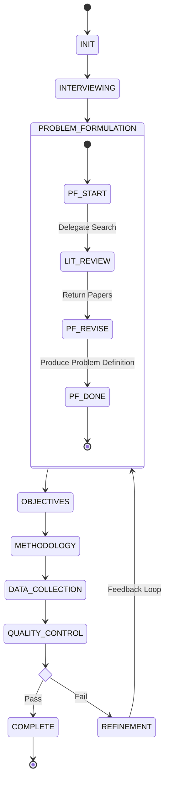

# 🏗️ System Architecture

## Overview

This project implements a sequential **Multi-Agent System (MAS)** for academic research proposal generation. It uses the **Orchestrator Pattern** to coordinate six specialized AI agents, ensuring that the output of one agent (e.g., Problem Definition) becomes the structured context for the next (e.g., Objectives), with a robust Quality Control loop for iterative refinement.

---

## 🧩 High-Level Design

### Agent Pipeline

The system processes data in a linear pipeline with a feedback loop:

```mermaid
graph TD
    User -->|Conversation| Interviewer
    Interviewer -->|UserProfile| PF[Problem Formulation]
    PF -->|ProblemDef| Obj[Objectives]
    Obj -->|ResearchObj| Meth[Methodology]
    Meth -->|MethodologyRec| Data[Data Collection]
    Data -->|DataPlan| QC[Quality Control]
    
    QC -->|Pass| End[Final Proposal]
    QC -->|Fail (Refine)| PF
```

### Workflow State Machine

The logic in `workflow_state.py` enforces these valid transitions:



---

## 🤖 Specialized Agents

Each agent is a self-contained module in `academic_research/sub_agents/`.

#### 1. **Interviewer Agent**
- **Purpose**: Interactive State Machine for gathering requirements.
- **Location**: [`sub_agents/interviewer/`](../academic_research/sub_agents/interviewer/)
- **Input**: User String
- **Output**: `UserProfile`

#### 2. **Problem Formulation Agent**
- **Purpose**: Defines the research gap using real literature.
- **Location**: [`sub_agents/problem_formulation/`](../academic_research/sub_agents/problem_formulation/)
- **Tools**: Delegates to `LiteratureReviewAgent` (`google_search`).
- **Output**: `ProblemDefinition`

#### 3. **Objectives Agent**
- **Purpose**: Translates the problem into SMART goals.
- **Location**: [`sub_agents/objectives/`](../academic_research/sub_agents/objectives/)
- **Output**: `ResearchObjectives`

#### 4. **Methodology Agent**
- **Purpose**: Designs the scientific approach (Qual/Quant).
- **Location**: [`sub_agents/methodology/`](../academic_research/sub_agents/methodology/)
- **Output**: `MethodologyRecommendation`

#### 5. **Data Collection Agent**
- **Purpose**: Operational planning (Tools, Sample Size).
- **Location**: [`sub_agents/data_collection/`](../academic_research/sub_agents/data_collection/)
- **Output**: `DataCollectionPlan`

#### 6. **Quality Control Agent**
- **Purpose**: Validates logic, timeline, and feasibility.
- **Location**: [`sub_agents/quality_control/`](../academic_research/sub_agents/quality_control/)
- **Output**: `QualityValidation` (Scores + Refinement Targets)

---

## 🧬 Data Models

Strict Pydantic contracts defined in [`data_models.py`](../academic_research/data_models.py) ensure interface compatibility between agents.

| Model | Key Fields |
|-------|------------|
| **UserProfile** | `academic_program`, `field_of_study`, `total_timeline`, `constraints` |
| **ProblemDefinition** | `problem_statement`, `main_research_question`, `preliminary_literature` |
| **ResearchObjectives** | `general_objective`, `specific_objectives` (SMART), `alignment_check` |
| **MethodologyRec** | `recommended_methodology`, `methodology_type`, `timeline_fit` |
| **DataCollectionPlan** | `collection_techniques`, `estimated_sample_size`, `timeline_breakdown` |
| **QualityValidation** | `coherence_score`, `feasibility_score`, `requires_refinement` |

---

## 🎼 Orchestration Logic

The [`ResearchProposalOrchestrator`](../academic_research/orchestrator.py) is the central controller.

### 1. Execution Strategy
*   **Sequential**: It calls agents one by one.
*   **Context Injection**: Before calling an agent, it uses a `format_prompt` helper function to inject the outputs of *all* previous agents into the prompt context.
*   **JSON Extraction**: Uses regex fallbacks to parse JSON from LLM responses even if they contain Markdown (` ```json `).

### 2. Refinement Loop Logic
When `QualityValidation.requires_refinement` is `True`:
1.  Orchestrator checks `refinement_count < max_refinements` (default 3).
2.  Transitions to `REFINEMENT` state.
3.  Loops back to `run_problem_formulation`.
4.  **Crucially**, it passes the `quality_validation.recommendations` as a `feedback` string to the Problem Formulation agent, enabling it to improve the next draft.

---

## 🛠️ Infrastructure Components

### State Management
*   **`workflow_state.py`**: Defines the `WorkflowContext` class and valid state transitions.
*   **`state_manager.py`**: Serializes the context to JSON files in `.gemini/state/`.

### Communication
*   **`communication.py`**: Defines the `AgentMessage` envelope (ID, Timestamp, Sender, Content).
*   **`message_router.py`**: A Pub/Sub bus that logs all agent-to-agent traffic to `.gemini/logs/`.

### Configuration
*   **`config.py`**: Centralizes settings like `DEFAULT_MODEL` ("gemini-2.0-flash-lite") and `RETRY_CONFIG` (exponential backoff for API 429 errors).

---

## 🧪 Testing Strategy

| Level | Tool | Scope | Command |
|-------|------|-------|---------|
| **Unit** | `pytest` | Internal logic, state transitions, regex parsing. Mocks LLMs. | `uv run pytest tests/` |
| **Integration** | `eval/` | End-to-end flow with real LLMs. Checks JSON validity. | `python eval/test_multi_agent_pipeline.py` |
| **Manual** | `demos/` | Interactive CLI for specific agents. | `python demos/demo_problem_formulation.py` |

---

## 📐 Design Patterns Used

1.  **Orchestrator Pattern**: Centralized control flow vs. Choreography (decentralized).
2.  **Factory Pattern**: `create_..._agent()` functions encapsulate model config and tool binding.
3.  **State Machine**: Explicit state transitions prevent logic errors (e.g., skipping objectives).
4.  **Chain of Thought**: Agents act sequentially, mimicking human reasoning steps.
5.  **Tool Use**: The Problem Formulation agent delegates to a specific "Search Tool" rather than searching itself.

---

## See Also

- [Data Flow Documentation](./DATA_FLOW.md)
- [Agent Guide](./AGENT_GUIDE.md)
- [Project README](../README.md)