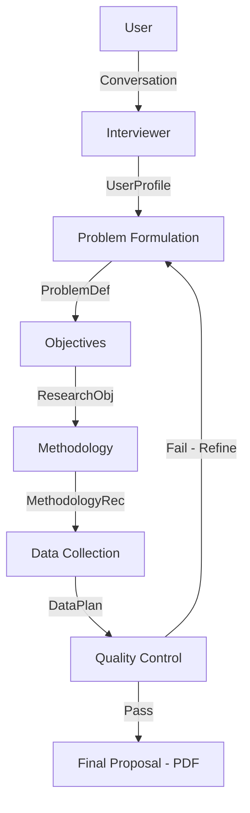

# 🏗️ System Architecture

## Overview

This project implements a sequential **Multi-Agent System (MAS)** for academic research proposal generation. It uses the **Orchestrator Pattern** to coordinate six specialized AI agents, ensuring that the output of one agent (e.g., Problem Definition) becomes the structured context for the next (e.g., Objectives), with a robust Quality Control loop for iterative refinement.

---

## 🧩 High-Level Design

### Agent Pipeline

The system processes data in a linear pipeline with a feedback loop:



### Workflow State Machine

The logic in `workflow_state.py` enforces these valid transitions:


---

## 🤖 Specialized Agents

Each agent is a self-contained module in `aida/sub_agents/`.

#### 1. **Interviewer Agent**
- **Purpose**: Interactive State Machine for gathering requirements.
- **Location**: [`sub_agents/interviewer/`](../aida/sub_agents/interviewer/)
- **Input**: User String
- **Output**: `UserProfile`

#### 2. **Problem Formulation Agent**
- **Purpose**: Defines the research gap using real literature.
- **Location**: [`sub_agents/problem_formulation/`](../aida/sub_agents/problem_formulation/)
- **Tools**: Delegates to `LiteratureReviewAgent` (`google_search`).
- **Output**: `ProblemDefinition`

#### 3. **Objectives Agent**
- **Purpose**: Translates the problem into SMART goals.
- **Location**: [`sub_agents/objectives/`](../aida/sub_agents/objectives/)
- **Output**: `ResearchObjectives`

#### 4. **Methodology Agent**
- **Purpose**: Designs the scientific approach (Qual/Quant).
- **Location**: [`sub_agents/methodology/`](../aida/sub_agents/methodology/)
- **Output**: `MethodologyRecommendation`

#### 5. **Data Collection Agent**
- **Purpose**: Operational planning (Tools, Sample Size).
- **Location**: [`sub_agents/data_collection/`](../aida/sub_agents/data_collection/)
- **Output**: `DataCollectionPlan`

#### 6. **Quality Control Agent**
- **Purpose**: Validates logic, timeline, and feasibility.
- **Location**: [`sub_agents/quality_control/`](../aida/sub_agents/quality_control/)
- **Output**: `QualityValidation` (Scores + Refinement Targets)

---

## 🧬 Data Models

Strict Pydantic contracts defined in [`data_models.py`](../aida/data_models.py) ensure interface compatibility between agents.

| Model | Key Fields |
|-------|------------|
| **UserProfile** | `academic_program`, `field_of_study`, `total_timeline`, `constraints` |
| **ProblemDefinition** | `problem_statement`, `main_research_question`, `preliminary_literature` |
| **ResearchObjectives** | `general_objective`, `specific_objectives` (SMART), `alignment_check` |
| **MethodologyRec** | `recommended_methodology`, `methodology_type`, `timeline_fit` |
| **DataCollectionPlan** | `collection_techniques`, `estimated_sample_size`, `timeline_breakdown` |
| **QualityValidation** | `coherence_score`, `feasibility_score`, `requires_refinement` |

---

## 🎼 Orchestration Logic

The [`ResearchProposalOrchestrator`](../aida/orchestrator.py) is the central controller.

### 1. Execution Strategy
*   **Sequential**: It calls agents one by one based on the state machine.
*   **Ephemeral Runners**: For every agent execution, it creates a new `InMemoryRunner`. This ensures that tool execution history (like Google Search results) is fresh for the specific task and prevents context pollution between stages.
*   **Context Injection**: Before calling an agent, it uses `format_prompt` helper functions to inject the outputs of *all* relevant previous agents into the prompt.

### 2. JSON Robustness
The orchestrator implements a multi-stage JSON extractor (`_extract_json_from_response`) to handle LLM variability:
1.  **Direct Parse**: `json.loads()`
2.  **Markdown Stripping**: Removes ` ```json ` fences.
3.  **Regex Recovery**: Extracts `{ ... }` blocks from mixed conversational text.

### 3. Refinement Loop Logic
When `QualityValidation.requires_refinement` is `True`:
1.  Orchestrator checks `refinement_count < MAX_REFINEMENTS` (from config).
2.  Transitions to `REFINEMENT` state.
3.  Loops back to `run_problem_formulation`.
4.  **Crucially**, it passes the `quality_validation.recommendations` as a `refinement_feedback` string to the Problem Formulation agent, prompting a revision.

---

## 🛠️ Infrastructure Components

### State & Workflow
*   **`workflow_state.py`**: Defines the `WorkflowContext` class and valid state transitions.
*   **`orchestrator.py`**: Manages the in-memory state of the proposal parts (`self.problem_definition`, etc.).

### Configuration & Environment
*   **`config.py`**: Centralizes settings like `DEFAULT_MODEL` ("gemini-2.0-flash-lite") and `RETRY_CONFIG` (exponential backoff for API 429 errors).
*   **`__init__.py`**: Handles environment detection.
    *   **Vertex AI**: Used if `GOOGLE_GENAI_USE_VERTEXAI` is True (auto-detects Project/Region).
    *   **Standard API**: Used if False (requires `GOOGLE_API_KEY`).

### Output Generation
*   **`pdf_generator.py`**: A utility module using `reportlab`.
    *   Takes the final aggregated dictionary of Pydantic models.
    *   Renders a professional PDF with Table of Contents, Hyperlinks for Literature, and structured headings.

---

## 🧪 Testing Strategy

The architecture supports testing via the `InMemoryRunner` pattern:

1.  **Unit Testing**: Individual agents can be tested by instantiating them and passing a mock prompt to an `InMemoryRunner`.
2.  **Orchestrator Testing**: The Orchestrator accepts a `runner` argument (or creates one internally), allowing for end-to-end integration tests where prompts are mocked or real LLM calls are made.

| Level | Tool | Scope | Command |
|-------|------|-------|---------|
| **Unit** | `pytest` | Internal logic, state transitions, regex parsing. Mocks LLMs. | `uv run pytest tests/` |
| **Integration** | `eval/` | End-to-end flow with real LLMs. Checks JSON validity. | `python eval/test_multi_agent_pipeline.py` |
| **Manual** | `demos/` | Interactive CLI for specific agents. | `python demos/demo_problem_formulation.py` |

---

## 📐 Design Patterns Used

1.  **Orchestrator Pattern**: Centralized control flow (`ResearchProposalOrchestrator`) rather than decentralized choreography.
2.  **Factory Pattern**: `create_..._agent()` functions encapsulate model config and tool binding.
3.  **State Machine**: Explicit `WorkflowState` enum prevents logic errors (e.g., skipping objectives).
4.  **Tool Use**: The Problem Formulation agent delegates to a specific "Search Tool" via `AgentTool`.
5.  **Strict Typing**: Usage of Pydantic models for all agent interfaces ensures data integrity.

---

## See Also

- [Project README](../README.md)
- [Agent Guide](./AGENT_GUIDE.md)
- [Data Flow Documentation](./DATA_FLOW.md)