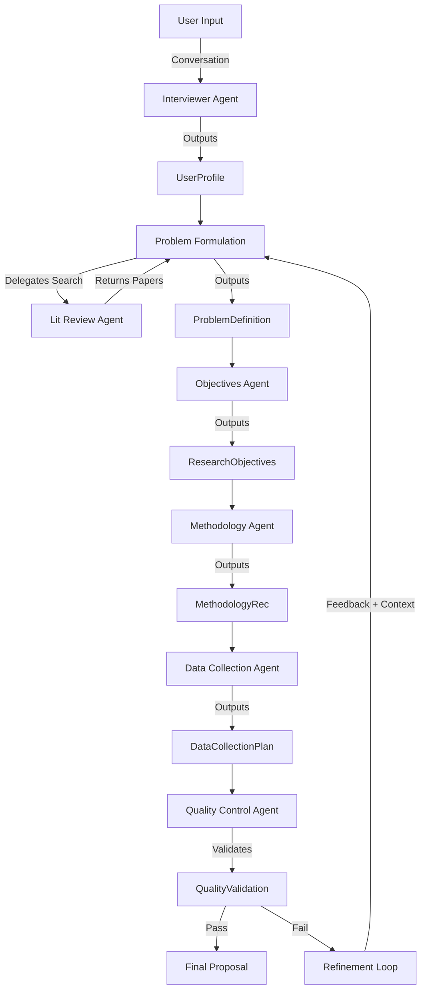
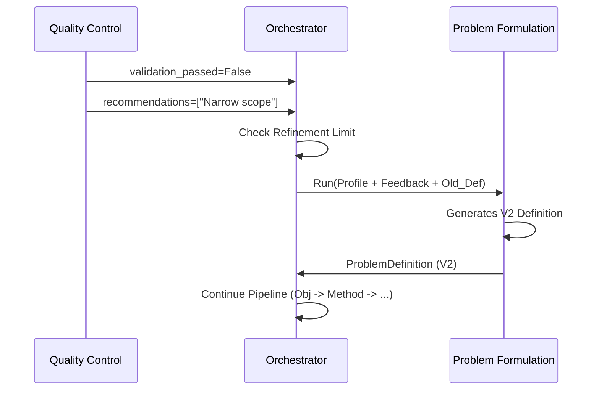

# 🔄 Data Flow Documentation

## Overview

This document describes how data flows through the Multi-Agent Research Proposal System, from initial user input to the final generated proposal. It details the transformation of data at each stage and the strict Pydantic contracts that enforce integrity.

---

## 🗺️ High-Level Flow



---

## 🔍 Detailed Data Flow by Stage

### Stage 1: User Profile Collection

*   **Agent**: `InterviewerAgent` (State Machine)
*   **Input**: Interactive strings from user
*   **Output Model**: `UserProfile`

```python
UserProfile {
    academic_program: str         # "Master's", "PhD"
    field_of_study: str           # "Computer Science"
    research_area: str            # "Multi-Agent Systems"
    weekly_hours: int             # 15
    total_timeline: Timeline {
        value: int                # 6
        unit: str                 # "months"
    }
    existing_skills: List[str]    # ["Python", "Data Analysis"]
    missing_skills: List[str]     # ["Game Theory"]
    constraints: List[str]        # ["No budget", "Remote only"]
    additional_context: Optional[str]
}
```

---

### Stage 2: Problem Formulation

*   **Agent**: `ProblemFormulationAgent`
*   **Input**: `UserProfile`
*   **Internal Tool**: Calls `LiteratureReviewAgent` -> `google_search`
*   **Output Model**: `ProblemDefinition`

**Search Delegation Flow**:
1. Main Agent receives Profile.
2. Calls Tool: `literature_review_agent(field="CS", area="MAS")`.
3. Tool performs Google Search (site:arxiv.org, etc.).
4. Tool returns list of valid URLs.
5. Main Agent synthesizes `ProblemDefinition`.

```python
ProblemDefinition {
    problem_statement: str        # Contextualized gap analysis
    main_research_question: str   # The primary question
    secondary_questions: List[str]# 2-4 sub-questions
    key_variables: List[str]      # e.g. "Agent Coordination", "Latency"
    preliminary_literature: [     # Sourced from Tool
        {
            "title": str,
            "url": str,           # Validated URL
            "relevance_note": str,# Why this paper matters
            "source": str         # e.g. "arxiv.org"
        }
    ],
    refinement_history: List[Dict]
}
```

---

### Stage 3: Objectives Generation

*   **Agent**: `ObjectivesAgent`
*   **Input**: `UserProfile` + `ProblemDefinition`
*   **Output Model**: `ResearchObjectives`

**Transformation Logic**:
*   Maps `main_research_question` -> `general_objective`.
*   Maps `secondary_questions` -> `specific_objectives` (SMART criteria).

```python
ResearchObjectives {
    general_objective: str
    specific_objectives: List[str] # 3-5 SMART objectives
    feasibility_notes: Dict {
        "timeline_assessment": str,
        "skills_required": List[str],
        "constraint_compliance": str
    }
    alignment_check: Dict {
        "coverage_analysis": str,  # Ensures all RQs are answered
        "coherence_score": str     # "High/Medium/Low"
    }
}
```

---

### Stage 4: Methodology Recommendation

*   **Agent**: `MethodologyAgent`
*   **Input**: `UserProfile` + `ProblemDefinition` + `ResearchObjectives`
*   **Output Model**: `MethodologyRecommendation`

```python
MethodologyRecommendation {
    recommended_methodology: str   # e.g. "Simulated Experiments"
    methodology_type: str          # "quantitative"
    justification: str
    required_skills: List[str]     # e.g. "Python", "Reinforcement Learning"
    timeline_fit: Dict {
        "is_feasible": bool,
        "estimated_duration": str,
        "key_phases": List[Dict]
    }
    alternative_methodologies: List[Dict] # Backups with Pros/Cons
}
```

---

### Stage 5: Data Collection Planning

*   **Agent**: `DataCollectionAgent`
*   **Input**: `UserProfile` + `ResearchObjectives` + `MethodologyRecommendation`
*   **Output Model**: `DataCollectionPlan`

```python
DataCollectionPlan {
    collection_techniques: List[str] # e.g. "Simulation Logs"
    recommended_tools: [
        {
            "name": str,           # "PettingZoo"
            "type": str,           # "Software Library"
            "accessibility": str,  # "Free/Open Source"
            "learning_curve": str
        }
    ]
    data_sources: List[str]        # "Generated Synthetic Data"
    estimated_sample_size: str     # "10,000 episodes"
    timeline_breakdown: Dict {     # Phased schedule
        "preparation": Dict,
        "collection": Dict,
        "total_duration": str
    }
    resource_requirements: List[str]
}
```

---

### Stage 6: Quality Control & Validation

*   **Agent**: `QualityControlAgent`
*   **Input**: **Aggregation of Stages 1-5**
*   **Output Model**: `QualityValidation`

**Validation Logic**:
1.  **Coherence (0.0-1.0)**: Logical flow from Problem -> Method.
2.  **Feasibility (0.0-1.0)**: `DataCollection.duration` <= `UserProfile.total_timeline`.
3.  **Overall Score**: `((Coherence + Feasibility) / 2) * 100`.

```python
QualityValidation {
    validation_passed: bool        # True only if Score >= 0.65 AND No Critical Issues
    coherence_score: float
    feasibility_score: float
    overall_quality_score: float   # 0-100
    issues_identified: [
        {
            "severity": "critical|major|minor",
            "component": "data_collection",
            "description": str,
            "impact": str
        }
    ],
    recommendations: List[str]     # Specific feedback
    requires_refinement: bool
    refinement_targets: List[str]  # e.g. ["problem_definition"]
}
```

---

## 🔄 Refinement Loop Flow

When `QualityValidation.requires_refinement` is **True**:

1.  **Orchestrator** checks `workflow_context.refinement_count`.
2.  If limit not reached:
    *   Extracts `recommendations` from QC output.
    *   Constructs a **Feedback Prompt**.
    *   Loops back to **Stage 2 (Problem Formulation)**.
3.  **Problem Formulation Agent** receives:
    *   Original User Profile.
    *   *Previous* Problem Definition.
    *   **Context**: "Refine the previous definition based on this feedback: [QC Recommendations]".



---

## 💾 State Persistence

The system uses `state_manager.py` to persist data to the local file system.

*   **State File**: `.gemini/state/{run_id}_state.json`
    *   Stores current step (`WorkflowState`) and history.
*   **Snapshots**: `.gemini/snapshots/{run_id}_iter{N}_{timestamp}.json`
    *   Full dump of all agent outputs at a specific point in time.

---

## 🛡️ Error Handling

*   **JSON Extraction**: `orchestrator._extract_json_from_response` uses regex fallbacks to handle mixed Markdown/JSON outputs.
*   **Retry Logic**: `config.RETRY_CONFIG` handles 429 (Rate Limit) and 5xx errors automatically.
*   **Transition Checks**: `workflow_state.is_valid_transition` prevents out-of-order execution.