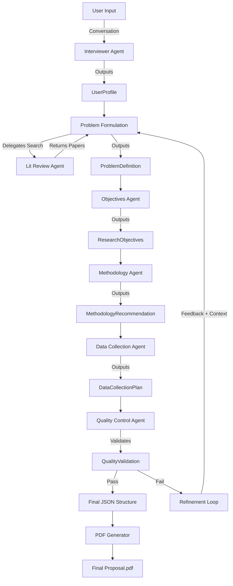
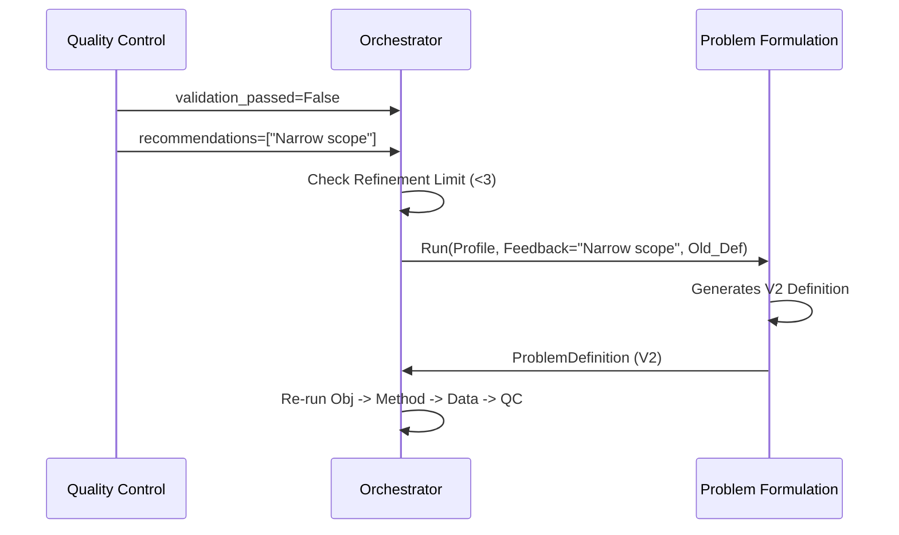

# 🔄 Data Flow Documentation

## Overview

This document describes how data flows through the Multi-Agent Research Proposal System, from initial user input to the final generated PDF proposal. It details the transformation of data at each stage and the strict Pydantic contracts that enforce integrity between the Orchestrator and the Agents.

---

## 🗺️ High-Level Flow



---

## 🔍 Detailed Data Flow by Stage

### Stage 1: User Profile Collection

*   **Agent**: `InterviewerAgent`
*   **Input**: Interactive strings from user (or static profile in autonomous mode)
*   **Output Model**: `UserProfile`

```python
UserProfile {
    academic_program: str         # "Master's", "PhD"
    field_of_study: str           # "Computer Science"
    research_area: str            # "Multi-Agent Systems"
    weekly_hours: int             # 15
    total_timeline: Timeline {
        value: int                # 6
        unit: str                 # "months"
    }
    existing_skills: List[str]    # ["Python", "Data Analysis"]
    missing_skills: List[str]     # ["Game Theory"]
    constraints: List[str]        # ["No budget", "Remote only"]
    additional_context: Optional[str]
}
```

---

### Stage 2: Problem Formulation

*   **Agent**: `ProblemFormulationAgent`
*   **Input**: `UserProfile`
*   **Internal Tool**: Calls `LiteratureReviewAgent` via `AgentTool`
*   **Output Model**: `ProblemDefinition`

**Search Delegation Flow**:
1. Orchestrator calls `ProblemFormulationAgent`.
2. Agent calls Tool: `literature_review_agent(field="CS", area="MAS")`.
3. Tool performs Google Search (via `google_search` function).
4. Tool returns list of `LiteratureEntry` items.
5. Agent synthesizes `ProblemDefinition` using real citations.

```python
ProblemDefinition {
    problem_statement: str        # Contextualized gap analysis
    main_research_question: str   # The primary question
    secondary_questions: List[str]# 2-4 sub-questions
    key_variables: List[str]      # e.g. "Agent Coordination", "Latency"
    preliminary_literature: [     # List[LiteratureEntry]
        {
            "title": str,
            "url": str,           # Validated URL
            "relevance_note": str,# Why this paper matters
            "source": str         # e.g. "arxiv.org"
        }
    ],
    refinement_history: List[Union[Dict, str]]
}
```

---

### Stage 3: Objectives Generation

*   **Agent**: `ObjectivesAgent`
*   **Input**: `UserProfile` + `ProblemDefinition`
*   **Output Model**: `ResearchObjectives`

**Transformation Logic**:
*   Maps `main_research_question` -> `general_objective`.
*   Maps `secondary_questions` -> `specific_objectives` (SMART criteria).

```python
ResearchObjectives {
    general_objective: str
    specific_objectives: List[str] # 3-5 SMART objectives
    feasibility_notes: Dict {
        "timeline_assessment": str,
        "skills_required": List[str],
        "risk_factors": List[str]
    }
    alignment_check: Dict {
        "coverage_analysis": str,  # Ensures all RQs are answered
        "coherence_score": str     # "High/Medium/Low"
    }
}
```

---

### Stage 4: Methodology Recommendation

*   **Agent**: `MethodologyAgent`
*   **Input**: `UserProfile` + `ProblemDefinition` + `ResearchObjectives`
*   **Output Model**: `MethodologyRecommendation`

```python
MethodologyRecommendation {
    recommended_methodology: str   # e.g. "Simulated Experiments"
    methodology_type: str          # "quantitative"
    justification: str
    required_skills: List[str]     # e.g. "Python", "Reinforcement Learning"
    timeline_fit: Dict {
        "is_feasible": bool,
        "estimated_duration": str,
        "key_phases": List[Dict]
    }
    alternative_methodologies: List[Dict] # Backups with Pros/Cons
}
```

---

### Stage 5: Data Collection Planning

*   **Agent**: `DataCollectionAgent`
*   **Input**: `UserProfile` + `ResearchObjectives` + `MethodologyRecommendation`
*   **Output Model**: `DataCollectionPlan`

```python
DataCollectionPlan {
    collection_techniques: List[str] # e.g. "Simulation Logs"
    recommended_tools: [
        {
            "name": str,           # "PettingZoo"
            "type": str,           # "Software Library"
            "accessibility": str,  # "Free/Open Source"
            "learning_curve": str
        }
    ]
    data_sources: List[str]        # "Generated Synthetic Data"
    estimated_sample_size: str     # "10,000 episodes"
    timeline_breakdown: Dict {     # Phased schedule
        "preparation": Dict,
        "collection": Dict,
        "quality_check": Dict,
        "total_duration": str
    }
    resource_requirements: List[str]
}
```

---

### Stage 6: Quality Control & Validation

*   **Agent**: `QualityControlAgent`
*   **Input**: **Aggregation of Stages 1-5**
*   **Output Model**: `QualityValidation`

**Validation Logic**:
1.  **Coherence (0.0-1.0)**: Logical flow from Problem -> Method.
2.  **Feasibility (0.0-1.0)**: `DataCollection.duration` <= `UserProfile.total_timeline`.
3.  **Overall Score**: `((Coherence + Feasibility) / 2) * 100`.

```python
QualityValidation {
    validation_passed: bool        # True only if Coherence >= 0.7 AND Feasibility >= 0.7 AND No Critical Issues
    coherence_score: float
    feasibility_score: float
    overall_quality_score: float   # 0-100
    issues_identified: [
        {
            "severity": "critical|major|minor",
            "component": "data_collection",
            "description": str,
            "impact": str
        }
    ],
    recommendations: List[str]     # Specific feedback used for refinement
    requires_refinement: bool
    refinement_targets: List[str]  # e.g. ["problem_definition"]
}
```

---

### Stage 7: PDF Generation

*   **Module**: `pdf_generator.py`
*   **Input**: Aggregated JSON Dictionary (from `orchestrator._generate_final_proposal`)
*   **Output**: Binary PDF Stream (`BytesIO`)

The generator converts the raw Pydantic dictionaries into a ReportLab document structure:
*   **Hyperlinks**: `ProblemDefinition.preliminary_literature` URLs become clickable links.
*   **Formatting**: Headers, bullet points, and justified text are applied for readability.

---

## 🔄 Refinement Loop Flow

When `QualityValidation.requires_refinement` is **True**:

1.  **Orchestrator** checks `workflow_context.refinement_count` against `config.MAX_REFINEMENTS`.
2.  If limit not reached:
    *   Extracts `recommendations` from QC output.
    *   Transitions state to `WorkflowState.REFINEMENT`.
    *   Loops back to **Stage 2 (Problem Formulation)**.
3.  **Problem Formulation Agent** receives a modified prompt containing:
    *   Original User Profile.
    *   *Previous* Problem Definition.
    *   **Refinement Context**: "Refine the problem definition based on the user's feedback: [QC Recommendations]".



---

## 🛡️ Data Handling & Error Recovery

### JSON Robustness
The `Orchestrator` (`_extract_json_from_response`) uses a three-tier strategy to prevent crashes from malformed LLM output:
1.  **Strategy 1 (Direct)**: Attempts `json.loads(response)`.
2.  **Strategy 2 (Clean)**: Removes Markdown fences (` ```json ` ... ` ``` `) and attempts parse.
3.  **Strategy 3 (Regex)**: Scans the text for the outermost `{ ... }` block and attempts to parse it, ignoring conversational text surrounding the JSON.

### State Persistence
The system assumes the use of a `StateManager` (not detailed in this document but referenced in architecture) to save:
*   **Snapshots**: `orchestrator.run_workflow` returns a full dictionary of the proposal state which can be serialized to JSON.
*   **Workflow History**: The `WorkflowContext` object tracks every state transition (`from_state`, `to_state`, `timestamp`), which is returned in the final result metadata for auditability.

---

## 🛡️ Error Handling & Resilience

The system implements defense-in-depth strategies to handle the unpredictability of LLMs and external APIs.

### 1. Network & API Layer
*   **Retry Logic**: `config.RETRY_CONFIG` is applied to every model call. It handles **HTTP 429 (Rate Limit)** and **5xx (Server Errors)** using exponential backoff (base 7, 5 attempts).
*   **Resource Cleanup**: The `_execute_agent` method uses Python async context managers (`async with`) to ensure `InMemoryRunner` sessions are properly closed, preventing TCP connector leaks during long workflows.

### 2. Parsing Layer
*   **JSON Recovery**: As detailed above, the Orchestrator uses regex fallbacks to extract valid JSON even if the model "chatters" (adds conversational text).
*   **Empty Response Detection**: If an agent returns no text (e.g., only tool outputs), the Orchestrator inspects the session history to recover the last generated content before raising an error.

### 3. Application Layer
*   **State Safety**: Transitions are guarded by `workflow_state.is_valid_transition`. An agent cannot arbitrarily jump from "Interview" to "Data Collection".
*   **Global Exception Handling**: Every agent execution is wrapped in a `try/except` block. If an unrecoverable error occurs (e.g., Pydantic validation failure), the system transitions to `WorkflowState.ERROR` and returns the error message in the final result object, preventing a full crash.

---

## See Also

- [System Architecture](./ARCHITECTURE.md)
- [Project README](../README.md)